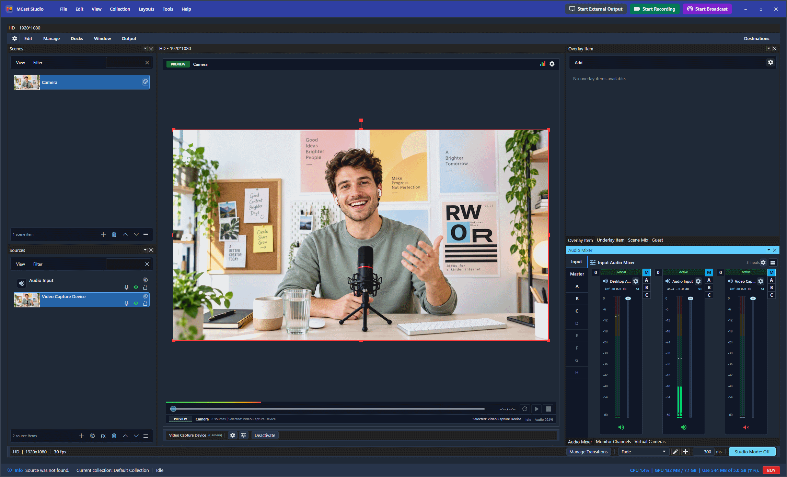

# MCast Studio Flatpak packaging

This independent public repository contains packaging tools and desktop metadata for MCast Studio. Application source remains in its private repository. No existing repository needs a visibility change. Windows distribution remains Microsoft Store only; do not upload Windows installers here.

Linux release **1.0.40** is being verified before publication. Application ID: **com.mcaststudio.MCast**. Packaging targets Linux x86_64 with GNOME runtime 50 and uses the `stable` branch. A Flathub store listing is not available yet.



The maintainer-selected listing image is `screenshots/mcast-studio-workspace.png`. The candidate workflow preselects its public URL for the default AppStream screenshot. It is a product screenshot supplied by the maintainer, not evidence of Linux runtime verification.

The earlier **1.0.0-beta.1** package remains a private draft and is not the current release.

## Install or update the signed release

Install Flatpak using [your distribution's setup instructions](https://flathub.org/setup). Download the versioned `.flatpak` bundle and `mcast-studio-release-key.asc` from the same [published GitHub release](https://github.com/gyanjarahatke-cpu/mcast-studio-flathub/releases). The release will appear there only after installation and runtime verification succeeds.

From the folder containing those files, run:

```sh
flatpak remote-add --user --if-not-exists flathub https://dl.flathub.org/repo/flathub.flatpakrepo
flatpak install --user --or-update --gpg-file=mcast-studio-release-key.asc MCastStudio-1.0.40-x86_64.flatpak
flatpak run com.mcaststudio.MCast//stable
```

The install command checks the bundle signature and downloads the declared runtime if needed. Review the signing-key fingerprint published on the MCast website before trusting the key. `SHA256SUMS` and its detached signature `SHA256SUMS.asc` are also included for independent verification. Download future MCast releases and repeat the install command with the new filename; `flatpak update` alone cannot download new MCast bundles from GitHub Releases.

Camera, microphone and screen-capture access still follows the permissions and portal support of your Linux desktop. Virtual-camera output additionally needs the host's kernel component; the Flatpak cannot install a kernel module inside its sandbox. Follow the website's current Linux installation guidance for this component. Do not assume Windows game-capture hook support applies to Linux.

## Sign the release

Build the canonical self-contained runtime archive inside the selected GNOME SDK, then use the existing manifest generator through the signing-required release tool:

```sh
python3 scripts/prepare_runtime_archive.py \
  --canonical "$REPOSITORY/src/MCastStudio/bin/linux-x64/Release" \
  --source-manifest "$VERIFIED_SOURCE_MANIFEST" \
  --stage "$NEW_DEPLOYMENT_STAGE" --archive "$ARCHIVE" \
  --receipt "$NEW_ARCHIVE_RECEIPT" --epoch "$SOURCE_DATE_EPOCH"

python3 scripts/build_signed_release.py \
  --archive "$ARCHIVE" --archive-receipt "$NEW_ARCHIVE_RECEIPT" \
  --sha256 "$SHA256" --version 1.0.40 --date "$RELEASE_DATE" \
  --screenshot-url "$SCREENSHOT_URL" \
  --host-component "$VERIFIED_CAMERA_DEB" \
  --gpg-homedir "$SIGNING_KEY_HOME" --gpg-key "$SIGNING_FINGERPRINT" \
  --work "$EMPTY_LINUX_WORK_DIRECTORY" --output "$EMPTY_RELEASE_DIRECTORY"
```

Use one persistent, protected release signing key retained outside Git. The tool requires its full fingerprint, signs the Flatpak repository commit, embeds the public key in the bundle, and signs the release checksums. It never creates a disposable key, copies private-key material, publishes files, or stores secrets in GitHub Actions. The work directory must be on a native Linux filesystem; existing files are never overwritten. Verify the installed package and its runtime behavior before publishing the resulting assets.

The host-camera package must be `mcast-virtual-camera_1.0.40_all.deb`. Its exact assets and installation scripts must match the canonical application archive. The release tool checks package identity, dependencies, ownership, file modes and the fixed file list before signing it separately and including it in the signed checksums. The package requires v4l2loopback 0.15.0 or newer; older utilities do not provide the required device-creation interface.

After testing the exact signed assets, finalize the same output directory:

```sh
python3 scripts/build_signed_release.py finalize \
  --output "$RELEASE_DIRECTORY" --runtime-evidence "$VERIFIED_RUNTIME_EVIDENCE" \
  --gpg-homedir "$SIGNING_KEY_HOME" --gpg-key "$SIGNING_FINGERPRINT"
```

Runtime evidence identifies the version, source-manifest digest, archive, bundle and host-package digests. It records named checks and public summaries, including successful signature verification, Flatpak installation, launch, shutdown and host-component installation/verification. Other hardware paths must be explicitly recorded as unverified when they were not exercised. Finalization rejects failed checks, changed assets and missing required results, then signs the completed receipt and checksums. Publish only after `release-verification.json` states `publicationReady: true`.

The archive preparer copies the canonical runtime into a deployment stage, normalizes only that stage's native library lookup paths, checks every ELF against the actual GNOME Platform 50 runtime, and verifies the exact source manifest before and after packaging. It excludes named test/debug products, rejects private/source files, preserves relative links and executable modes, and leaves the canonical build untouched. It requires `readelf`, `patchelf`, Flatpak, and the installed GNOME Platform 50 runtime.

## Prepare a candidate

After the remaining application changes, produce and verify the complete self-contained Linux x64 Release output using the application's normal native build and publish process. The archive must contain the contents of that output at its root, including MCast, native libraries, .NET runtime, Browser, Resources, and Tools. Preserve executable bits and relative library links. Do not include source, credentials, development data, or debug symbols.

Compile native code and publish the managed application against the selected GNOME SDK. The application's canonical Release output can be mounted into that build environment. A build on a newer host distribution can import libc symbols unavailable in the Flatpak runtime. Verify ELF dependencies and launch the installed package inside its declared runtime before publishing the archive.

Publish that Linux archive to an upstream HTTPS release location. Record its SHA-256 and a real screenshot of the Linux application. The packaging workflow requires these actual inputs; it does not contain a fake binary URL or checksum.

Use **Actions → Build unsigned Flatpak candidate → Run workflow** with the archive URL, SHA-256, version, release date, and screenshot URL for packaging checks only. This workflow has no release signing key and its unsigned artifact is not a public release. Every workflow is manual; pushing this setup starts no build. No private-repository token is required. It does not submit to Flathub or create releases automatically.

To inspect a manifest that references a verified public release archive, run:

```sh
python3 scripts/prepare_release.py --archive "$ARCHIVE" --url "$RELEASE_URL" --sha256 "$SHA256" --version 1.0.40 --date "$RELEASE_DATE" --screenshot-url "$SCREENSHOT_URL"
```

The generated directory is the standalone packaging input. It contains only the manifest, launcher, icon, desktop entry, metadata, and flathub.json; it references the verified public archive rather than copying the binary into Git.

For installation testing before the archive is public, use the signing-required release tool above. It invokes this same generator with the verified local archive and does not publish a release or supply invented URLs. Generated local manifests contain a machine path and must not be committed or submitted to Flathub.

## Before Flathub submission

A human maintainer must review the [requirements](https://docs.flathub.org/docs/for-app-authors/requirements) and follow the [submission process](https://docs.flathub.org/docs/for-app-authors/submission) after the stable release has been built, installed, and exercised in the sandbox. Use the current supported runtime at submission time. This GitHub release does not establish a Flathub listing or approval.

Flathub's current policy requires disclosure of AI-generated application or packaging material and its approximate extent, and prohibits AI-generated or AI-assisted manifests. The packaging automation, generated manifest, tests, workflow, metadata, and this documentation were prepared with AI assistance; the icon is an existing MCast asset. These generated manifests are for the upstream GitHub package, not a Flathub submission. The private application has also received AI-assisted changes, whose extent the application maintainer must review. An AI agent must not open or automate the Flathub submission PR or generate its submission/review communication. This repository deliberately contains no submission bot or submission PR text template.

Validate the manifest with the Flathub linter and metadata with AppStream; supply real Linux screenshots and verify domain ownership for mcaststudio.com. Review the commercial license and redistribution terms before making a binary publicly available. An MCast account and valid application license are required.

## Sandbox verification

The launcher executes the packaged application in `/app/lib/mcast`. Application data follows the runtime-provided XDG data location and the application's existing MCast directory. No second settings store or host escape is introduced.

Permissions cover network streaming, X11/Wayland display, PulseAudio/PipeWire audio, device access for cameras/GPU/capture hardware, selected media directories, Secret Service for protected credentials, and the Avahi system service for native network-device discovery. The Avahi permission grants access to that named service only; the host Avahi service must be available for network discovery. Device access is broad because the native capture path uses V4L2 and optional capture devices; this must be justified during review. No host filesystem, unrestricted bus, host-spawn, or sandbox-disable permission is granted.

Verify launch, license sign-in and browser return, file pickers, camera/audio/screen capture, CEF, GPU preview/program, recording/streaming, shutdown, and data persistence under Flatpak. Kernel virtual-camera modules and vendor hardware drivers are host prerequisites; their sandbox availability is unverified. Do not label these integrations supported until exercised. The candidate builder is not hardware or Store certification.

## Packaging checks

```sh
python3 -m unittest discover -s tests -v
```

These checks validate packaging inputs and generated files. They do not launch or build MCast. The `Check packaging tools` workflow is also manual.
